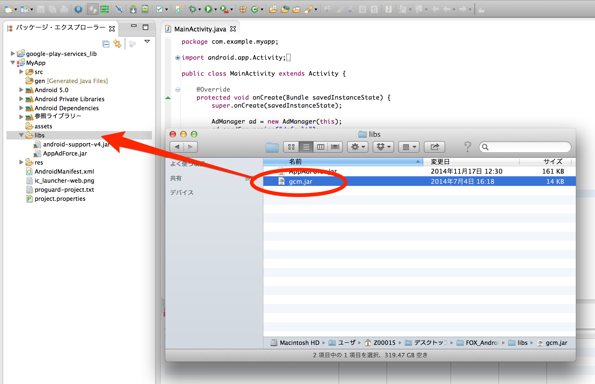
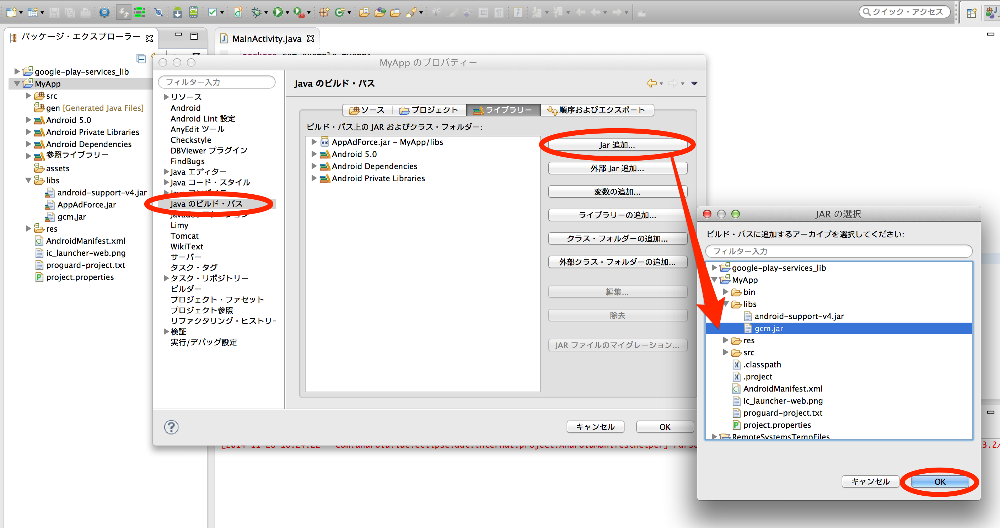

## プッシュ通知機能の実装
F.O.Xのプッシュ通知機能は、Googleが提供するGCM(Google Cloud Messaging for Android)を利用して、ユーザーの端末にプッシュ通知を行う機能です。
プッシュ通知を行うために、以下の実装を行ってください。

## gcm.jarの追加

- Androidプロジェクトの「libs」フォルダ配下にgcm.jarをコピー
- Androidプロジェクトを選択し、右クリック→「プロパティー」を選択
- 左のメニューから「Javaのビルド・パス」を選択
- 右側のメイン画面にある「ライブラリー」タブを選択
- メイン画面の右側にある「Jar追加」を選択
- Androidプロジェクトの「libs」フォルダーに配置した「gcm.jar」を選択
- メイン画面に「gcm.jar」が表示されていることを確認





## AndroidManifest.xmlの設定

### パーミッションの設定

下記のように、プッシュ通知を受け取るために必要なパーミッションの設定を\<manifest\>タグ内に追加してください。

```xml
<uses-permission android:name="android.permission.WAKE_LOCK" />
<uses-permission android:name="アプリのパッケージ名.permission.C2D_MESSAGE" />
<permission android:name="アプリのパッケージ名.permission.C2D_MESSAGE" android:protectionLevel="signature" />
<uses-permission android:name="com.google.android.c2dm.permission.RECEIVE" />
```

### プッシュ通知用レシーバーの設定

下記のように、プッシュ通知を受け取るために必要なレシーバーの設定を\<application\>タグ内に追加してください。

```xml
<receiver android:name="jp.appAdForce.android.NotifyReceiver"
	android:permission="com.google.android.c2dm.permission.SEND">
	<intent-filter>
		<action android:name="com.google.android.c2dm.intent.RECEIVE" />
		<action android:name="com.google.android.c2dm.intent.REGISTRATION" />
		<category android:name="アプリのパッケージ名" />
	</intent-filter>
</receiver>
```

### 二つのレシーバーを共存させる場合

com.google.android.c2dm.intent.RECEIVEとcom.google.android.c2dm.intent.REGISTRATIONに対するレシーバークラスは一つしか選択できません。アプリケーションが二つのレシーバークラスを必要とする場合は、以下の設定を追記してください。

```xml
<meta-data android:name="APPADFORCE_NOTIFY_RECEIVER" android:value="共存させたいF.O.X以外のレシーバークラス" />
```

内部的にはjp.appAdForce.android.NotifyReceiverクラスから、共存させたいレシーバークラスのonResume()、もしくはonMessage()、onRegistered()を呼び出します。


## Main Activityの設定

アプリケーションの起動時に呼び出されるActivityのonCreate()に次の処理を実装します。

```java
import jp.appAdForce.android.AdManager;
import jp.appAdForce.android.NotifyManager;

@Override
public void onCreate(Bundle savedInstanceState) {
	
	//...

	AdManager ad = new AdManager(this);
	ad.sendConversion("default");
	
	NotifyManager notifyManager = new NotifyManager(this, ad);
	String regId = notifyManager.getRegistrationId();
	if ("".equals(regId)||regId == null) {
		GCMRegistrar.register(this, ××××);
	}
}
```

××××の部分には、ProjectNumberを入力してください。

## 遷移先指定

Push通知をタップした際に、アプリ内の任意の地点を開くことが可能です。遷移先のURLスキームは、FOXの管理画面で設定することができます。

AndroidManifest.xml上で、Push通知のタップ時に起動させたいActivityタグ内にURLスキームの設定を行ってください。

例として、"foo://bar"というURLスキームでExampleActiviyを起動させたい場合の設定を記載します。

```xml
<activity android:name=".ExampleActivity" >
	<intent-filter>
		<category android:name="android.intent.category.DEFAULT" />
		<category android:name="android.intent.category.BROWSABLE" />
		<action android:name="android.intent.action.VIEW" />
		<data android:host="fuga" android:scheme="hoge" />
	</intent-filter>
</activity>
```

